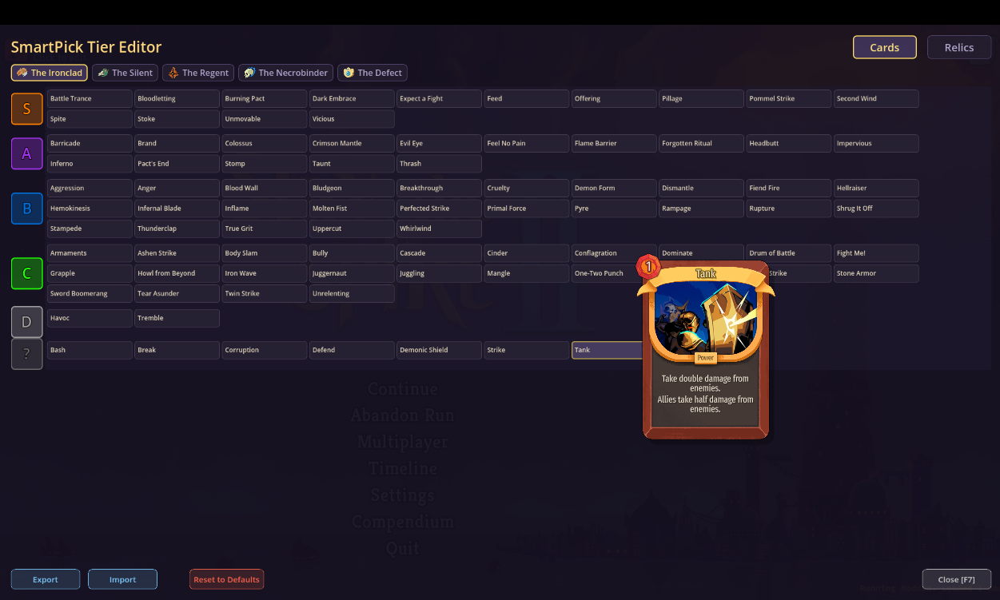

# SmartPick — Card & Relic Tier Badges for Slay the Spire 2




A lightweight mod that shows **tier ratings** directly on cards and relics in Slay the Spire 2. Instantly see which picks are S-tier and which are trash — no external overlay needed. Don't agree with the ratings? Press **F7** to open the built-in tier editor!

## Features

### Tier Badges

- **Tier badges on every card** — colored circle (S/A/B/C/D) with a blended score, shown on:
  - Card reward screen (post-combat & events)
  - Deck view
  - Merchant shop
  - Card forge / transform / enchant / remove screens
  - Bundle selection (start of run)
  - Card compendium (library)
- **Tier badges on relics** — shown on:
  - Relic reward screen (post-combat)
  - Merchant shop
  - Treasure room
  - Relic compendium

### In-Game Tier Editor (F7)

- Press **F7** at any time to open the tier editor
- **Drag-and-drop** cards and relics between S/A/B/C/D tiers
- **Reorder within tiers** — position determines score (first = strongest)
- Separate tabs for Cards (with character filter) and Relics
- Full card preview and game hover tips on hover
- Ancient/unassigned relics can be dragged into any tier
- Auto-saves on every change

### Share Tier Lists

- **Export** — copies your full tier list as JSON to clipboard
- **Import** — paste someone else's tier list from clipboard
- Import shows a visual diff: which items changed tiers (old → new)
- Share via Discord, Reddit, or any text channel

### Other

- **Two card tier sources blended** — combines [Mobalytics](https://mobalytics.gg/slay-the-spire-2/tier-lists/cards) and [slaythespire-2.com](https://slaythespire-2.com/card-tier) tier lists into a single rating
- **Relic tiers** from [Mobalytics](https://mobalytics.gg/slay-the-spire-2/tier-lists/relics) (global, not per-character)
- **All 5 characters supported** — Ironclad, Silent, Defect, Regent, Necrobinder
- **Multiplayer compatible**
- **WoW-style color coding:**
  - **S** — Orange (legendary)
  - **A** — Purple (epic)
  - **B** — Blue (rare)
  - **C** — Green (uncommon)
  - **D** — Grey (poor)

## Installation

### Download

Download the latest zip from [GitHub Releases](https://github.com/vasia123/STS2-SmartPickMod/releases) or [Nexus Mods](https://www.nexusmods.com/slaythespire2).

1. Extract all files to `Slay the Spire 2/mods/`
2. Enable in game: **Settings > Modding > SmartPick > Restart**

### Build from source

1. **Build the mod** (requires [.NET 9 SDK](https://dotnet.microsoft.com/download/dotnet/9.0) and [Godot 4.5 .NET](https://godotengine.org/download)):

   ```
   dotnet build SmartPick.csproj
   ```

   This copies `SmartPick.dll`, `SmartPick.pck`, and `SmartPick.json` into your game's `mods\` folder.

2. **Enable the mod in-game:** Settings > Modding > Enable **SmartPick** > Restart.

> If the build fails with "file is being used by another process", close the game first.

## Configuration

If your game is not in the default Steam location, create `local.props`:

```xml
<Project>
  <PropertyGroup>
    <STS2GamePath>D:\YourPath\Slay the Spire 2</STS2GamePath>
    <GodotExePath>C:\Path\To\Godot_v4.5-stable_mono_win64.exe</GodotExePath>
  </PropertyGroup>
</Project>
```

## How it works

The mod uses [HarmonyLib](https://github.com/pardeike/Harmony) to hook into game screens and attaches Godot UI elements (tier badges) to card nodes. Card identity is read directly from the game's `CardModel` — no heuristics or name parsing needed.

Tier data from two community sources is embedded in the DLL as JSON resources and blended into a single S/A/B/C/D rating per card per character.

## Data sources

- **[Mobalytics](https://mobalytics.gg/slay-the-spire-2/tier-lists/cards)** — card tier list
- **[slaythespire-2.com](https://slaythespire-2.com/card-tier)** — community wiki card tiers
- **[Mobalytics](https://mobalytics.gg/slay-the-spire-2/tier-lists/relics)** — relic tier list

Tier list JSONs are in `data/tier_lists/`. Or use the in-game editor (F7) to customize ratings.

## License

MIT
